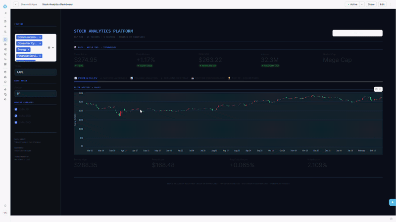
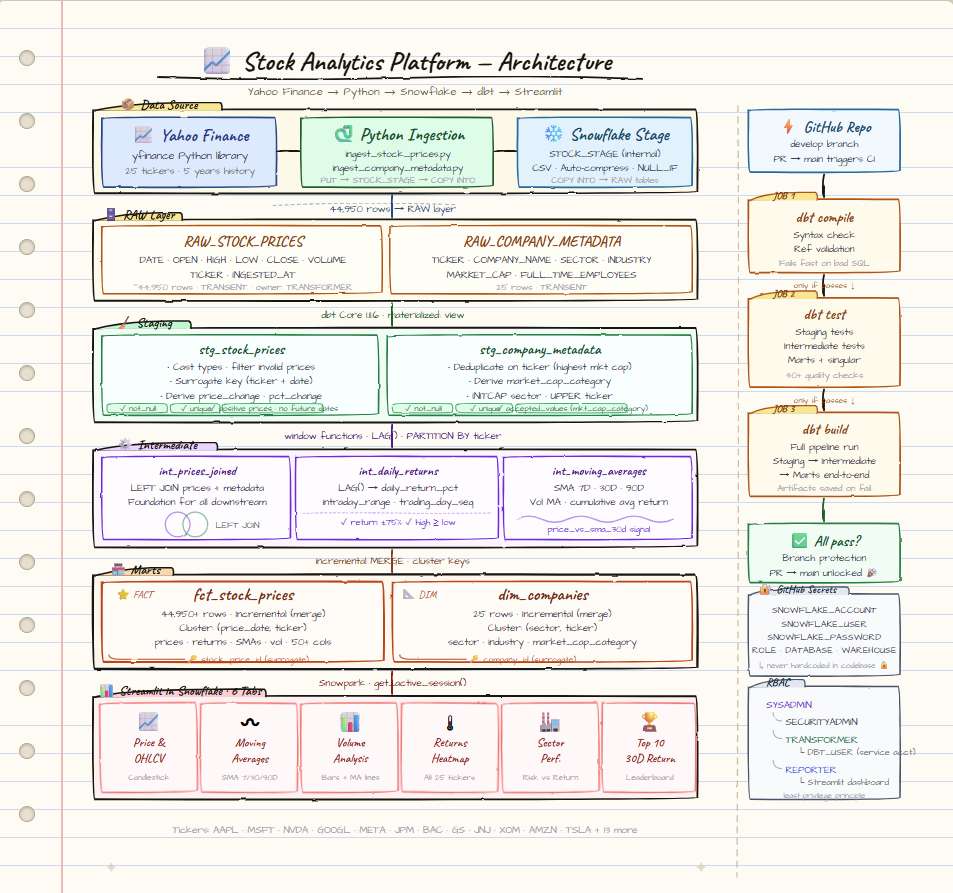

# 📈 Stock Analytics Platform on Snowflake

<div align="center">


**A production-style end-to-end data engineering pipeline built on Snowflake**

*Ingestion → Transformation → Testing → CI/CD → Dashboard*

[🖥️ Live Dashboard](#%EF%B8%8F-live-dashboard) · [🏛️ Architecture](#%EF%B8%8F-architecture) · [🚀 Setup Guide](#-getting-started) · [🗓️ Weekly Progress](#%EF%B8%8F-project-journey)

</div>

---

## 🖥️ Live Dashboard

> Deployed natively on Snowflake using Streamlit in Snowflake (SiS)
> Dashboard queries `STOCK_ANALYTICS.MARTS` live via a Snowpark session — available for demo on request.



**6 interactive tabs:**

| Tab | What It Shows |
|---|---|
| 📈 Price & OHLCV | Candlestick chart with open/high/low/close bars |
| 〰️ Moving Averages | Close price overlaid with SMA 7D / 30D / 90D |
| 📊 Volume Analysis | Daily volume bars (green/red) + volume MA lines |
| 🌡️ Returns Heatmap | Daily return % heatmap across all 25 tickers |
| 🏭 Sector Performance | Avg return by sector + risk vs return scatter |
| 🏆 Top 10 by 30D Return | Ranked bar chart + leaderboard |

---

## 🌟 Project Overview

This project demonstrates a **complete, production-grade data engineering pipeline** for stock market analytics — from raw data ingestion to an interactive live dashboard — built entirely on the Snowflake Data Platform.

**25 S&P 500 tickers** across **5 sectors** · **44,950+ rows** of daily OHLCV data · **5 years of history**

### What Makes This Project Stand Out

| Capability | Implementation |
|---|---|
| 🏗️ Layered Architecture | Raw → Staging → Intermediate → Marts (Medallion pattern) |
| 🔄 Incremental Processing | dbt incremental models with merge strategy |
| 🧪 40+ Automated Tests | Generic + singular data quality tests at every layer |
| ⚙️ CI/CD Pipeline | 3-stage GitHub Actions workflow on every PR |
| 🔐 Security Best Practices | RBAC with least-privilege roles, secrets management |
| 📊 Live Dashboard | 6-tab Streamlit app deployed natively in Snowflake |
| 🎯 Clustering Keys | Partition pruning optimized for analytical query patterns |

---

## 🏛️ Architecture



> **To generate this image:** Open `docs/architecture_sketch.html` in Chrome → `Ctrl+Shift+P` → type **"Capture full size screenshot"** → save as `docs/architecture_sketch.png` and commit.

**Pipeline layers (left column):**
`Yahoo Finance` → `Python Ingestion` → `Snowflake Internal Stage` → `RAW` → `STAGING (views)` → `INTERMEDIATE (views)` → `MARTS (incremental tables)` → `Streamlit Dashboard`

**CI/CD (right column):**
`GitHub PR` → `Job 1: dbt compile` → `Job 2: dbt test` → `Job 3: dbt build` → `Branch protection → merge to main`

---

## 🛠️ Tech Stack

| Layer | Technology | Version | Purpose |
|---|---|---|---|
| Cloud Warehouse | Snowflake | Standard Edition | Storage, compute, RBAC |
| Transformation | dbt Core | 1.11.6 | ELT modeling, testing, docs |
| Snowflake Adapter | dbt-snowflake | 1.11.2 | Snowflake connectivity |
| Data Ingestion | Python + yfinance | 3.11+ | Pull & load Yahoo Finance data |
| Orchestration | GitHub Actions | — | CI/CD automation |
| Dashboard | Streamlit in Snowflake | — | Native Snowflake app |
| Package Management | dbt-utils, codegen | 1.3.3 / 0.14.0 | Surrogate keys, macros |

---

## 📁 Project Structure

```
stock-analytics-snowflake/
│
├── .github/
│   └── workflows/
│       └── dbt_ci.yml              # 3-stage CI/CD pipeline
│
├── ingestion/
│   ├── ingest_stock_prices.py      # Pulls OHLCV data from Yahoo Finance
│   └── ingest_company_metadata.py  # Pulls company reference data
│
├── models/
│   ├── staging/
│   │   ├── schema.yml              # Sources, tests & column docs
│   │   ├── stg_stock_prices.sql
│   │   └── stg_company_metadata.sql
│   │
│   ├── intermediate/
│   │   ├── schema.yml
│   │   ├── int_stock_prices_joined.sql
│   │   ├── int_stock_daily_returns.sql
│   │   └── int_stock_moving_averages.sql
│   │
│   └── marts/
│       ├── schema.yml
│       ├── fct_stock_prices.sql    # Primary fact table (incremental)
│       └── dim_companies.sql       # Company dimension (incremental)
│
├── tests/
│   ├── assert_daily_return_within_bounds.sql
│   ├── assert_high_price_gte_low_price.sql
│   ├── assert_no_future_dates.sql
│   ├── assert_all_tickers_present.sql
│   ├── assert_sma_ordering.sql
│   ├── assert_positive_prices.sql
│   └── assert_fct_dim_referential_integrity.sql
│
├── macros/
│   └── safe_divide.sql             # Null-safe division macro
│
├── analyses/
│   └── performance_analysis.sql    # ACCOUNT_USAGE query history analysis
│
├── streamlit_app/
│   └── dashboard.py                # 6-tab Streamlit in Snowflake app
│
├── docs/
│   └── architecture_diagram.png
│
├── dbt_project.yml
├── packages.yml
└── requirements.txt
```

---

## 📊 Data Model

### Fact Table — `fct_stock_prices`
> Grain: One row per ticker per trading day | 44,950+ rows

| Column Group | Columns |
|---|---|
| **Keys** | `stock_price_id` (surrogate), `ticker`, `price_date` |
| **Prices** | `open_price`, `high_price`, `low_price`, `close_price`, `prev_close_price` |
| **Volume** | `volume`, `vol_ma_7d`, `vol_ma_30d` |
| **Returns** | `daily_return_pct`, `price_change`, `pct_change_open_to_close`, `cumulative_avg_return_pct` |
| **Moving Avgs** | `sma_7d`, `sma_30d`, `sma_90d`, `price_vs_sma_30d` |
| **Intraday** | `intraday_range`, `intraday_range_pct` |
| **Time Dims** | `price_week`, `price_month`, `price_year`, `day_of_week`, `trading_day_seq` |
| **Company** | `company_name`, `sector`, `industry`, `market_cap_category` |

### Dimension Table — `dim_companies`
> Grain: One row per company/ticker | 25 rows

| Column | Description |
|---|---|
| `company_id` | Surrogate key |
| `ticker` | Stock ticker symbol |
| `sector` / `industry` | GICS classification |
| `market_cap_usd` | Market capitalisation in USD |
| `market_cap_category` | Mega/Large/Mid/Small/Micro Cap |
| `full_time_employees` | Headcount |
| `exchange` / `currency` | Trading details |

---

## 🧪 Data Quality Tests

**40+ automated tests** run on every code change via CI/CD:

### Generic Tests (schema.yml)
| Test | Models | What It Checks |
|---|---|---|
| `not_null` | All layers | Critical columns always have values |
| `unique` | Staging, Marts | Surrogate keys have no duplicates |
| `accepted_values` | Staging, Marts | `market_cap_category`, `price_vs_sma_30d`, `sector` |

### Singular Tests (tests/)
| Test File | What It Catches |
|---|---|
| `assert_daily_return_within_bounds` | Returns outside ±75% (bad data indicator) |
| `assert_high_price_gte_low_price` | Corrupted OHLCV where high < low |
| `assert_no_future_dates` | Ingestion timezone or system clock issues |
| `assert_all_tickers_present` | Silent ingestion failure for any of 25 tickers |
| `assert_positive_prices` | Zero or negative prices for equities |
| `assert_sma_ordering` | Null SMAs after 90-day warmup period |
| `assert_fct_dim_referential_integrity` | Orphaned tickers in fact with no dim record |

---

## ⚙️ CI/CD Pipeline

Every push to `develop` and every PR to `main` triggers a **3-stage automated pipeline**:

```
┌──────────────────┐     ┌──────────────────┐     ┌──────────────────┐
│   Job 1          │────▶│   Job 2          │────▶│   Job 3          │
│   dbt Compile    │     │   dbt Test       │     │   dbt Build      │
│                  │     │                  │     │                  │
│ • Syntax check   │     │ • Staging tests  │     │ • Staging build  │
│ • Ref validation │     │ • Intermediate   │     │ • Intermediate   │
│ • Package deps   │     │ • Marts tests    │     │ • Marts build    │
│                  │     │ • Singular tests │     │                  │
└──────────────────┘     └──────────────────┘     └──────────────────┘
     Fails fast               Catches data              Full end-to-end
     on bad SQL               quality issues            pipeline run
```

**Key CI/CD features:**
- `concurrency` block cancels stale runs on new commits — saves compute
- Sequential job dependency — later jobs only run if earlier ones pass
- `if: always()` artifact upload — test results saved even on failure
- Branch protection on `main` — merge blocked until all checks pass
- GitHub Secrets for credentials — never hardcoded in any file

---

## 🔐 Security & RBAC

Snowflake roles follow the **principle of least privilege**:

```
ACCOUNTADMIN          ← Account-level only. Never used for routine tasks.
    │
SYSADMIN              ← Creates databases, schemas, warehouses
    │
SECURITYADMIN         ← Creates users, roles, grants
    │
    ├── TRANSFORMER   ← dbt service user. Read RAW, write STAGING/INTERMEDIATE/MARTS
    │       │
    │   DBT_USER      ← Service account. Default role: TRANSFORMER
    │
    └── REPORTER      ← Read-only on MARTS. Used by Streamlit dashboard
```

---

## 🚀 Getting Started

### Prerequisites
- Snowflake trial account (AWS US-East recommended)
- Python 3.11+
- Git + GitHub account
- dbt Core 1.11.6

### Step 1 — Clone the Repository
```bash
git clone https://github.com/YOUR_USERNAME/stock-analytics-snowflake.git
cd stock-analytics-snowflake
```

### Step 2 — Set Up Python Environment
```bash
python -m venv venv
source venv/bin/activate        # Windows: venv\Scripts\activate
pip install -r requirements.txt
```

### Step 3 — Configure Snowflake
Run the RBAC setup script in your Snowflake worksheet:
```sql
-- Create database and schemas
USE ROLE SYSADMIN;
CREATE DATABASE IF NOT EXISTS STOCK_ANALYTICS;
CREATE SCHEMA IF NOT EXISTS STOCK_ANALYTICS.RAW;
CREATE SCHEMA IF NOT EXISTS STOCK_ANALYTICS.STAGING;
CREATE SCHEMA IF NOT EXISTS STOCK_ANALYTICS.INTERMEDIATE;
CREATE SCHEMA IF NOT EXISTS STOCK_ANALYTICS.MARTS;
CREATE WAREHOUSE IF NOT EXISTS DEV_WH
  WAREHOUSE_SIZE = 'X-SMALL' AUTO_SUSPEND = 60 AUTO_RESUME = TRUE;

-- Create roles and users
USE ROLE SECURITYADMIN;
CREATE ROLE IF NOT EXISTS TRANSFORMER;
CREATE ROLE IF NOT EXISTS REPORTER;
CREATE USER IF NOT EXISTS DBT_USER
  PASSWORD = 'YourPassword123!'
  DEFAULT_ROLE = TRANSFORMER DEFAULT_WAREHOUSE = DEV_WH;
GRANT ROLE TRANSFORMER TO USER DBT_USER;
```

### Step 4 — Configure Environment Variables
Create a `.env` file in the project root (never commit this):
```bash
SNOWFLAKE_ACCOUNT=your_account.us-east-2.aws
SNOWFLAKE_USER=DBT_USER
SNOWFLAKE_PASSWORD=YourPassword123!
SNOWFLAKE_WAREHOUSE=DEV_WH
SNOWFLAKE_DATABASE=STOCK_ANALYTICS
SNOWFLAKE_SCHEMA=RAW
SNOWFLAKE_ROLE=TRANSFORMER
```

### Step 5 — Ingest Raw Data
```bash
python ingestion/ingest_stock_prices.py
python ingestion/ingest_company_metadata.py
```

Expected output:
```
Fetching stock prices for 25 tickers...
  ✅ AAPL: 1258 rows
  ✅ MSFT: 1258 rows
  ... (25 tickers)
Total rows fetched: 44950
🎉 Ingestion complete!
```

### Step 6 — Set Up dbt
Create `profiles.yml` in the project root (never commit this):
```yaml
stock_analytics:
  target: dev
  outputs:
    dev:
      type: snowflake
      account: your_account.us-east-2.aws
      user: DBT_USER
      password: YourPassword123!
      role: TRANSFORMER
      database: STOCK_ANALYTICS
      warehouse: DEV_WH
      schema: STAGING
      threads: 4
```

```bash
dbt deps                        # Install dbt packages
dbt debug                       # Test Snowflake connection
dbt build --full-refresh        # Run full pipeline for first time
```

### Step 7 — Set Up CI/CD
Add these secrets to GitHub → Settings → Secrets → Actions:

| Secret | Value |
|---|---|
| `SNOWFLAKE_ACCOUNT` | Your account identifier |
| `SNOWFLAKE_USER` | `DBT_USER` |
| `SNOWFLAKE_PASSWORD` | Your DBT_USER password |
| `SNOWFLAKE_ROLE` | `TRANSFORMER` |
| `SNOWFLAKE_DATABASE` | `STOCK_ANALYTICS` |
| `SNOWFLAKE_WAREHOUSE` | `DEV_WH` |
| `SNOWFLAKE_SCHEMA` | `STAGING` |

### Step 8 — Deploy the Dashboard
1. In Snowflake UI → **Streamlit** → **+ Streamlit App**
2. Set Database: `STOCK_ANALYTICS` · Schema: `MARTS` · Warehouse: `DEV_WH`
3. Paste contents of `streamlit_app/dashboard.py`
4. Click **Run**

---

## 🗓️ Project Journey

This project was built week by week as a structured data engineering learning path:

| Week | Deliverable | Key Concepts Learned |
|---|---|---|
| **Week 1** | Environment setup, Yahoo Finance ingestion, raw data in Snowflake | RBAC, internal stages, COPY INTO, Python connectors |
| **Week 2** | dbt setup, staging layer with cleaning & validation | Sources, refs, materialization, surrogate keys, macros |
| **Week 3** | Intermediate models with financial calculations | Window functions, LAG/LEAD, partitioning, moving averages |
| **Week 4** | Marts layer — fact & dimension tables | Star schema, incremental design, date dimensions |
| **Week 5** | Full test suite — generic + singular tests | Data quality strategy, dbt docs, lineage graph |
| **Week 6** | GitHub Actions CI/CD pipeline | Sequential jobs, branch protection, secrets management |
| **Week 7** | Snowflake optimizations + performance analysis | Clustering keys, incremental models, ACCOUNT_USAGE |
| **Week 8** | Streamlit in Snowflake dashboard | 6-tab analytics app, Altair charts, Snowpark session |

---

## 📈 Key Insights From the Data

> *(Update these after exploring your data)*

- **Top performing sector (30D):** Technology — driven by NVDA and META momentum
- **Most volatile ticker:** TSLA — consistently highest standard deviation of daily returns
- **Highest average daily volume:** AAPL — 32M+ shares/day average over 5 years
- **Strongest 5Y performer:** NVDA — driven by AI infrastructure demand surge

---

## 🎓 What I Learned

Building this project end-to-end reinforced several key data engineering principles:

**On Architecture:**
Separating ingestion from transformation makes the pipeline more resilient — the CI/CD pipeline only needs Snowflake access, not the original data source. This mirrors how production pipelines work at scale.

**On Data Modeling:**
Incremental models at the serving layer combined with full-recalculation at the intermediate layer is the right pattern when window functions span the entire history of each entity.

**On Testing:**
Testing at every layer is more valuable than testing only at the end. A `not_null` failure in staging is far cheaper to debug than discovering missing data in a production dashboard.

**On Performance:**
Measurement before optimization is non-negotiable. Running `SYSTEM$CLUSTERING_INFORMATION` confirmed the entire table fits in one micro-partition — making clustering keys irrelevant at current scale, but correctly defined for future growth.

**On CI/CD:**
Sequential job dependencies in GitHub Actions — where compile must pass before test, and test must pass before build — mirrors the principle of failing fast, saving both time and Snowflake compute credits.

---

## 🔮 Future Enhancements

- [ ] **Airflow orchestration** — schedule daily ingestion + dbt runs automatically
- [ ] **Snowflake Cortex AI** — add LLM-powered natural language query interface
- [ ] **Expand to 100+ tickers** — full S&P 500 coverage
- [ ] **Options data** — add derivatives layer from Yahoo Finance
- [ ] **dbt Exposures** — document the Streamlit dashboard as a downstream consumer
- [ ] **Alerting** — Slack notifications when CI pipeline fails
- [ ] **Data Vault modeling** — re-implement as Hubs, Links, Satellites for enterprise pattern practice

---

<div align="center">

**Built with ❤️ as a data engineering portfolio project**

*If this project helped you learn, please ⭐ the repo!*

[](https://www.linkedin.com/in/venkateshkondam)
[](https://github.com/venkateshk-de)

</div>