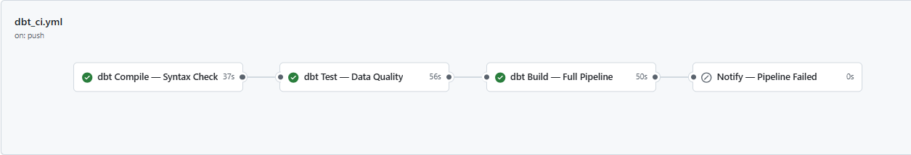

# 📈 Stock Market Analytics Platform on Snowflake

## Overview
An end-to-end ELT pipeline that ingests stock market data from the Yahoo Finance, transforms it through a layered dbt architecture, 
and serves analytics through a dimensional data mart.

## 📊 Project Documentation

Live dbt lineage graph and model docs:
👉 [https://venkateshk-de.github.io/stock-analytics-snowflake/](https://venkateshk-de.github.io/stock-analytics-snowflake/)

## Architecture

## Tech Stack
- **Snowflake** — Cloud data warehouse
- **dbt Core** — Data transformation & modeling
- **Yahoo Finance Data** — Stock market data source for selected tickers
- **GitHub Actions** — CI/CD for automated testing
- **Streamlit** — Analytics dashboard

## Project Structure
\`\`\`
stock-analytics-snowflake/
├── dbt_project/        # All dbt models, tests, macros
├── streamlit_app/      # Dashboard application
├── .github/workflows/  # CI/CD pipeline
└── docs/               # Architecture diagrams
\`\`\`

## Data Layers
| Layer | Purpose |
|---|---|
| Staging | Clean & rename raw Cybersyn data |
| Intermediate | Business logic, financial calculations |
| Marts | Fact & dimension tables for analytics |

## Lineage Diagram

## CI/CD Pipeline

All dbt models are automatically compiled, tested and built
on every push via GitHub Actions.

## Setup Instructions
_(To be filled as project progresses)_

## Key Insights
_(To be filled after data exploration)_
